# Retail CC AI Engineering Playbook

**The Complete Operating System for Autonomous AI Software Engineering**

[](https://github.com/retail-cc/retail-cc-ai-playbook)
[](https://github.com/retail-cc/retail-cc-ai-playbook)
[](https://github.com/retail-cc/retail-cc-ai-playbook)

---

## 📖 Table of Contents

1. [Executive Summary](#1-executive-summary)
2. [The Autonomous Engineering Operating Model](#2-the-autonomous-engineering-operating-model)
3. [Autonomous Agent Architecture](#3-autonomous-agent-architecture)
4. [Agent Access & Harness Integration](#4-agent-access--harness-integration)
5. [Autonomous Execution Pipeline](#5-autonomous-execution-pipeline)
6. [Workflow: Autonomous Feature Delivery](#6-workflow-autonomous-feature-delivery)
7. [Workflow: Autonomous Bug Resolution](#7-workflow-autonomous-bug-resolution)
8. [Workflow: Autonomous Refactoring](#8-workflow-autonomous-refactoring)
9. [Workflow: Autonomous Repository Creation](#9-workflow-autonomous-repository-creation)
10. [Workflow: Autonomous Architecture Evolution](#10-workflow-autonomous-architecture-evolution)
11. [Agent Role Matrix](#11-agent-role-matrix)
12. [Supervisor Expectations](#12-supervisor-expectations)
13. [Architect Expectations](#13-architect-expectations)
14. [Product Expectations](#14-product-expectations)
15. [Delivery Oversight Expectations](#15-delivery-oversight-expectations)
16. [The Autonomous Development Lifecycle](#16-the-autonomous-development-lifecycle)
17. [System Artifacts](#17-system-artifacts)
18. [Agent Governance Standards](#18-agent-governance-standards)
19. [Autonomous Execution Scenarios](#19-autonomous-execution-scenarios)
20. [System Anti-Patterns](#20-system-anti-patterns)
21. [Adoption & Evolution Roadmap](#21-adoption--evolution-roadmap)
22. [Visual Assets Reference](#22-visual-assets-reference)

---

## 1. Executive Summary

### 1.1 The Autonomous Operating System

Retail CC has transitioned to a fully autonomous AI-driven software engineering model. This is not AI-assisted development. This is AI-executed development with human supervision.

The **[`retail-cc-ai-harness`](https://github.com/retail-cc/retail-cc-ai-harness)** is the **executable intelligence layer** – the complete knowledge base that enables autonomous agents to understand, navigate, and modify the Retail CC system without human guidance.

This **Playbook** is the **system specification** – it defines how autonomous agents operate, how they interact with the Harness, and how humans supervise the process.

### 1.2 The Core Transformation

| Traditional Engineering | Autonomous Engineering |
|------------------------|------------------------|
| Engineer reads ticket | Agent reads ticket autonomously |
| Engineer finds files | Agent explores repository |
| Engineer reads architecture | Agent loads Harness context |
| Engineer writes spec | Agent generates spec from intent |
| Engineer creates plan | Agent builds implementation plan |
| Engineer guides AI | Agent executes autonomously |
| Engineer builds mental model | Agent builds system model from Harness |

### 1.3 Why This Exists

This system exists because:

1. **Scale** – Retail CC operates at enterprise scale with 15+ services, 20+ repositories, and growing
2. **Complexity** – Multi-agent A2A architecture, MCP tool layer, and orchestration require deep context
3. **Velocity** – Business demands faster delivery cycles
4. **Consistency** – Human engineers cannot maintain perfect architecture awareness across all components
5. **Quality** – Autonomous agents, when properly harnessed, produce more consistent, standards-compliant code

### 1.4 Mandatory Participation

| Role | Why They Must Engage |
|------|---------------------|
| **Engineer** | To supervise agent work, approve outputs, and maintain system integrity |
| **Senior Engineer** | To review agent-generated PRs and ensure architectural compliance |
| **Principal Engineer** | To govern agent capabilities and evolve the Harness |
| **Architect** | To maintain the Harness as the source of truth for agent reasoning |
| **Tech Lead** | To oversee agent execution and intervene when needed |
| **Engineering Manager** | To track agent performance and adoption metrics |
| **Product Manager** | To provide clear intent that agents can interpret autonomously |
| **Delivery Lead** | To orchestrate agent-driven releases and monitor system health |
| **QA Engineer** | To validate agent outputs against quality standards |
| **AI Champion** | To evolve agent capabilities and refine the Harness |
| **All New Hires** | Mandatory onboarding to understand the autonomous system |

> 🎯 **This playbook is mandatory reading for everyone involved in Retail CC software delivery.** System autonomy depends on human understanding of agent capabilities and boundaries.

---

## 2. The Autonomous Engineering Operating Model

### 2.1 The Core Principle

> **"Agents execute. Humans supervise. The Harness governs."**

<p align="center">
  
</p>

*Figure 1: The Retail CC Autonomous Engineering Operating Model – how Agents, Humans, and the Harness interact.*

### 2.2 The Actor Hierarchy

```mermaid
flowchart TD
    subgraph "CONTROL PLANE (Human)"
        ARCH[Architect – Harness Authority]
        TL[Tech Lead – Execution Oversight]
        PM[Product – Intent Provider]
        QA[QA – Quality Validator]
        DM[Delivery Manager – Release Orchestrator]
    end

    subgraph "EXECUTION PLANE (Agent)"
        A1[Primary Agent – Ticket Execution]
        A2[Investigation Agent – Discovery]
        A3[Generation Agent – Implementation]
        A4[Review Agent – Quality Assurance]
        A5[Registry Agent – Harness Updates]
    end

    subgraph "INTELLIGENCE LAYER (Harness)"
        H1[Architecture Knowledge]
        H2[Standards & Rules]
        H3[Workflow Prompts]
        H4[Validation Frameworks]
        H5[Historical Context]
    end

    subgraph "OUTPUT PLANE"
        O1[Specifications]
        O2[Implementation Plans]
        O3[Code + Tests]
        O4[PR + Reviews]
        O5[Deployed System]
        O6[Harness Updates]
    end

    PM -->|"Intent"| A1
    A1 -->|"Reads"| H1
    A1 -->|"Reads"| H2
    A1 -->|"Reads"| H3
    A1 -->|"Generates"| O1
    A1 -->|"Generates"| O2
    A2 -->|"Explores"| O5
    A2 -->|"Reads"| H1
    A3 -->|"Reads"| H2
    A3 -->|"Generates"| O3
    A4 -->|"Validates"| O3
    A4 -->|"Reads"| H4
    A4 -->|"Generates"| O4
    A5 -->|"Updates"| H1
    A5 -->|"Updates"| H2

    TL -->|"Approves"| O4
    QA -->|"Validates"| O3
    DM -->|"Orchestrates"| O5
    ARCH -->|"Governs"| H1
    ARCH -->|"Governs"| H2
```

### 2.3 The Autonomous Execution Cycle

```mermaid
flowchart LR
    subgraph "Phase 1: Intake"
        TICKET[Jira Ticket] --> AGENT1[Agent Ingests]
        AGENT1 --> AGENT2[Agent Understands]
    end

    subgraph "Phase 2: Discovery"
        AGENT2 --> AGENT3[Agent Explores Repo]
        AGENT3 --> AGENT4[Agent Loads Harness]
        AGENT4 --> AGENT5[Agent Builds Model]
    end

    subgraph "Phase 3: Execution"
        AGENT5 --> AGENT6[Agent Generates Spec]
        AGENT6 --> AGENT7[Agent Creates Plan]
        AGENT7 --> AGENT8[Agent Writes Code]
        AGENT8 --> AGENT9[Agent Generates Tests]
    end

    subgraph "Phase 4: Validation"
        AGENT9 --> AGENT10[Agent Self-Reviews]
        AGENT10 --> AGENT11[Agent Validates]
        AGENT11 --> AGENT12[Agent Creates PR]
    end

    subgraph "Phase 5: Human Gate"
        AGENT12 --> HUMAN[Human Reviews]
        HUMAN --> APPROVE{Approve?}
        APPROVE -->|Yes| MERGE[Merge]
        APPROVE -->|No| AGENT6
    end

    subgraph "Phase 6: Update"
        MERGE --> DEPLOY[Deploy]
        DEPLOY --> LEARN[Agent Learns]
        LEARN --> UPDATE[Agent Updates Harness]
    end

    UPDATE --> TICKET
```

### 2.4 The Role Transformation

| Old Role | New Role | Shift |
|----------|----------|-------|
| Engineer – Coder | Supervisor – Reviewer | From writing to auditing |
| Engineer – Planner | Supervisor – Approver | From planning to validating |
| Architect – Documenter | Architect – Harness Authority | From writing docs to governing intelligence |
| Tech Lead – Guide | Tech Lead – Gatekeeper | From guiding to approving |
| QA – Tester | QA – Validator | From testing to validating |
| Product – Requester | Product – Intent Provider | From writing tickets to providing clear intent |

---

## 3. Autonomous Agent Architecture

### 3.1 Agent Roles and Capabilities

```mermaid
flowchart TD
    subgraph "Primary Agent (Execution)"
        PA[Primary Agent]
        PA -->|1| READ[Reads Ticket]
        PA -->|2| EXPLORE[Explores Repository]
        PA -->|3| LOAD[Loads Harness Context]
        PA -->|4| SPEC[Generates Specification]
        PA -->|5| PLAN[Generates Implementation Plan]
        PA -->|6| CODE[Generates Code]
        PA -->|7| TESTS[Generates Tests]
        PA -->|8| REVIEW[Self-Review]
        PA -->|9| PR[Creates PR]
        PA -->|10| UPDATE[Updates Harness]
    end

    subgraph "Specialised Agents"
        IA[Investigation Agent]
        GA[Generation Agent]
        RA[Review Agent]
        HA[Harness Update Agent]
    end

    PA --> IA
    PA --> GA
    PA --> RA
    PA --> HA

    IA -->|"Discovers"| COMPONENTS[Components]
    IA -->|"Discovers"| DEPS[Dependencies]
    IA -->|"Discovers"| BOUNDARIES[Boundaries]

    GA -->|"Generates"| IMPL[Implementation]
    GA -->|"Generates"| TESTS2[Tests]
    GA -->|"Generates"| DOCS[Documentation]

    RA -->|"Validates"| STANDARDS[Standards]
    RA -->|"Validates"| ARCH[Architecture]
    RA -->|"Validates"| SEC[Security]
    RA -->|"Validates"| COVERAGE[Coverage]

    HA -->|"Updates"| H_ARCH[Architecture Files]
    HA -->|"Updates"| H_STD[Standards Files]
    HA -->|"Updates"| H_VERIFY[Verification Files]
```

### 3.2 Agent Capability Matrix

| Agent Role | Primary Responsibility | Reads From Harness | Writes To Output |
|------------|------------------------|---------------------|------------------|
| **Primary Agent** | End-to-end execution | All harness files | Specs, plans, code, tests, PRs |
| **Investigation Agent** | System discovery | `system-overview.md`, `component-catalog.md`, `dependency-map.md` | Discovery report |
| **Generation Agent** | Code and test generation | `coding-standards.md`, `engineering-rules.md`, `agent-architecture.md`, `mcp-architecture.md` | Code, tests |
| **Review Agent** | Quality validation | `review-standards.md`, `security-boundaries.md`, `testing-standards.md`, `contract-validation.md` | Review output, PR checklist |
| **Harness Update Agent** | Knowledge maintenance | All architecture files | Updated harness files |
| **Architecture Agent** | Design evolution | `architecture-decisions.md`, `system-overview.md` | ADRs, updated architecture |

### 3.3 Agent Decision Framework

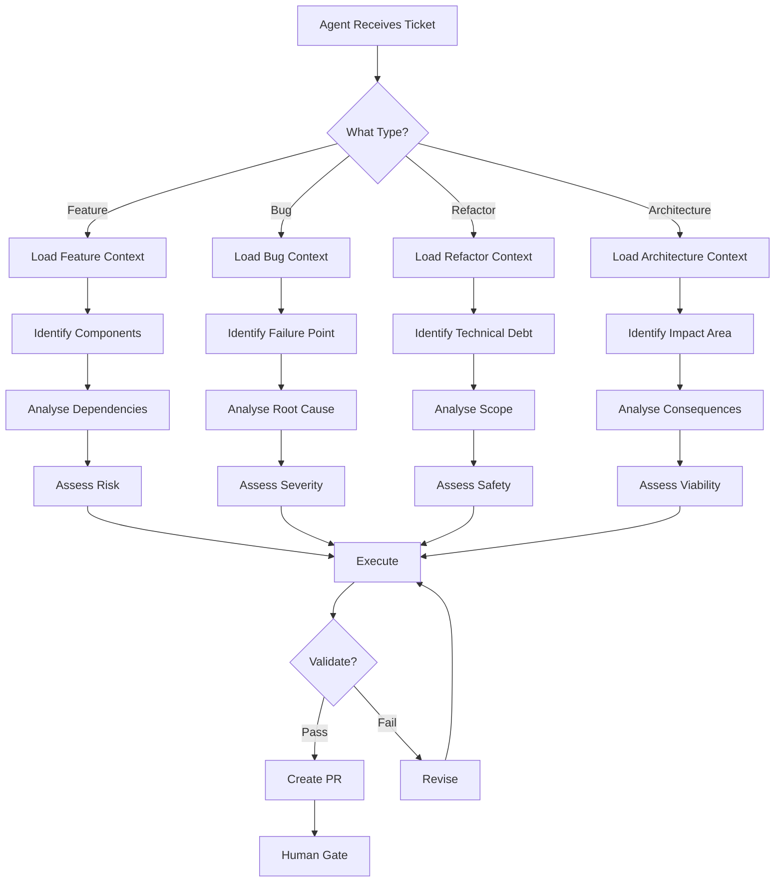

---

## 4. Agent Access & Harness Integration

### 4.1 The Harness Intelligence Layer

<p align="center">
  
</p>

*Figure 2: How Autonomous Agents Load Harness Intelligence – automated context discovery.*

### 4.2 Autonomous Context Loading

Unlike the manual approach in the legacy model, autonomous agents:

1. **Autonomously discover** which harness files are relevant
2. **Dynamically load** context based on the ticket
3. **Build a system model** from the loaded context
4. **Maintain context** throughout execution

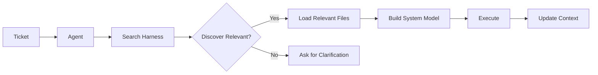

### 4.3 Mandatory Agent Context (Automatically Loaded)

| Context Category | Files | When Loaded |
|------------------|-------|-------------|
| **Foundation** | `README.md`, `AGENTS.md`, `CLAUDE.md` | Always |
| **Architecture** | `architecture/system-overview.md`, `architecture/component-catalog.md` | Always |
| **Rules** | `standards/engineering-rules.md`, `standards/coding-standards.md` | Always |
| **Security** | `standards/security-boundaries.md` | Always |

### 4.4 Dynamic Agent Context (Discovered Based on Ticket)

| Ticket Type | Additional Files Loaded |
|-------------|------------------------|
| **Agent change** | `architecture/agent-architecture.md`, `architecture/a2a-flows.md` |
| **API change** | `architecture/api-landscape.md`, `verification/contract-validation.md` |
| **MCP change** | `architecture/mcp-architecture.md` |
| **Voice change** | `architecture/voice-architecture.md` |
| **Frontend change** | `architecture/frontend-architecture.md` |
| **Architecture change** | `architecture/architecture-decisions.md` |
| **Security change** | `standards/security-boundaries.md` |
| **Testing change** | `verification/test-strategy.md`, `standards/testing-standards.md` |

### 4.5 Agent Tool Integration

#### Claude Code – Autonomous Mode

```bash
# Agent starts with full context discovery
claude --autonomous \
       --harness /path/to/retail-cc-ai-harness \
       --ticket BRAIN-1234 \
       --output plan.md,code,tests,pr.md
```

#### Cursor – Agent Mode

```json
{
  "agentMode": true,
  "harnessPath": "/path/to/retail-cc-ai-harness",
  "contextLoading": "autonomous",
  "outputArtifacts": ["spec", "plan", "code", "tests", "pr"]
}
```

#### GitHub Copilot – Agentic Suggestions

```json
{
  "agentic": true,
  "harnessContext": true,
  "contextFiles": ["AGENTS.md", "architecture/", "standards/"]
}
```

### 4.6 Future Agent Integration

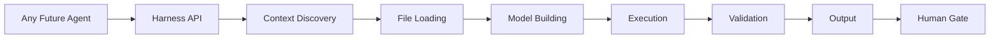

---

## 5. Autonomous Execution Pipeline

<p align="center">
  
</p>

*Figure 3: The Autonomous Execution Pipeline – 11 automated steps from ticket to deployment.*

### 5.1 Pipeline Overview

```mermaid
flowchart TD
    subgraph "1. INTAKE"
        TICKET[Jira Ticket] --> AGENT[Agent Receives]
        AGENT --> PARSE[Parses Ticket]
        PARSE --> UNDERSTAND[Understands Intent]
    end

    subgraph "2. DISCOVERY"
        UNDERSTAND --> EXPLORE[Explores Repository]
        EXPLORE --> LOAD[Loads Harness Context]
        LOAD --> IDENTIFY[Identifies Components]
        IDENTIFY --> TRACE[Traces Dependencies]
        TRACE --> RISK[Assesses Risk]
    end

    subgraph "3. PLANNING"
        RISK --> SPEC[Generates Specification]
        SPEC --> PLAN[Generates Implementation Plan]
        PLAN --> APPROVE1[Human Approves Plan]
    end

    subgraph "4. EXECUTION"
        APPROVE1 --> CODE[Generates Code]
        CODE --> TESTS[Generates Tests]
        TESTS --> DOCS[Generates Documentation]
    end

    subgraph "5. VALIDATION"
        DOCS --> UNIT[Runs Unit Tests]
        UNIT --> INTEGRATION[Runs Integration Tests]
        INTEGRATION --> LINT[Runs Linting]
        LINT --> SCAN[Runs Security Scan]
        SCAN --> REVIEW[Self-Review]
    end

    subgraph "6. SUBMISSION"
        REVIEW --> PR[Creates PR]
        PR --> AI_REVIEW[AI Review Pass]
        AI_REVIEW --> APPROVE2[Human Approves PR]
    end

    subgraph "7. RELEASE"
        APPROVE2 --> MERGE[Merge]
        MERGE --> DEPLOY[Deploy]
    end

    subgraph "8. UPDATE"
        DEPLOY --> LEARN[Learn]
        LEARN --> HARNESS[Update Harness]
    end

    HARNESS --> TICKET
```

### 5.2 Pipeline Phase Details

#### Phase 1: Intake (Agent Autonomous)

| Step | Agent Action | Input | Output |
|------|--------------|-------|--------|
| 1.1 | Receive ticket | Jira ticket | Ticket loaded |
| 1.2 | Parse ticket | Ticket text | Intent extracted |
| 1.3 | Understand intent | Intent | Change type identified |

#### Phase 2: Discovery (Agent Autonomous)

| Step | Agent Action | Input | Output |
|------|--------------|-------|--------|
| 2.1 | Explore repository | Repository | File inventory |
| 2.2 | Load Harness context | Harness files | System model |
| 2.3 | Identify components | System model | Affected components |
| 2.4 | Trace dependencies | Component list | Dependency graph |
| 2.5 | Assess risk | Dependency graph | Risk assessment |

#### Phase 3: Planning (Agent + Human)

| Step | Agent Action | Human Action | Output |
|------|--------------|--------------|--------|
| 3.1 | Generate specification | Review spec | `spec.md` |
| 3.2 | Generate implementation plan | Review plan | `plan.md` |
| 3.3 | Submit for approval | Approve/reject plan | Approved plan |

#### Phase 4: Execution (Agent Autonomous)

| Step | Agent Action | Input | Output |
|------|--------------|-------|--------|
| 4.1 | Generate code | Plan | Implementation code |
| 4.2 | Generate tests | Spec + Code | Test files |
| 4.3 | Generate documentation | Code | Documentation |

#### Phase 5: Validation (Agent Autonomous)

| Step | Agent Action | Input | Output |
|------|--------------|-------|--------|
| 5.1 | Run unit tests | Code + Tests | Test results |
| 5.2 | Run integration tests | Code + Tests | Integration results |
| 5.3 | Run linting | Code | Lint results |
| 5.4 | Run security scan | Code | Security results |
| 5.5 | Self-review | All outputs | Review output |

#### Phase 6: Submission (Agent + Human)

| Step | Agent Action | Human Action | Output |
|------|--------------|--------------|--------|
| 6.1 | Create PR | Review PR | Pull request |
| 6.2 | Run AI review | – | AI review output |
| 6.3 | Submit for human review | Approve/reject | Approved PR |

#### Phase 7: Release (Agent + Human)

| Step | Agent Action | Human Action | Output |
|------|--------------|--------------|--------|
| 7.1 | Merge | Approve merge | Merged code |
| 7.2 | Deploy | Orchestrate release | Deployed system |

#### Phase 8: Update (Agent Autonomous)

| Step | Agent Action | Input | Output |
|------|--------------|-------|--------|
| 8.1 | Learn from deployment | System metrics | Learnings |
| 8.2 | Update Harness | Learnings | Updated harness files |

---

## 6. Workflow: Autonomous Feature Delivery

<p align="center">
  
</p>

*Figure 4: Autonomous Feature Delivery – swimlane showing agent actions across phases.*

### 6.1 The Autonomous Feature Flow

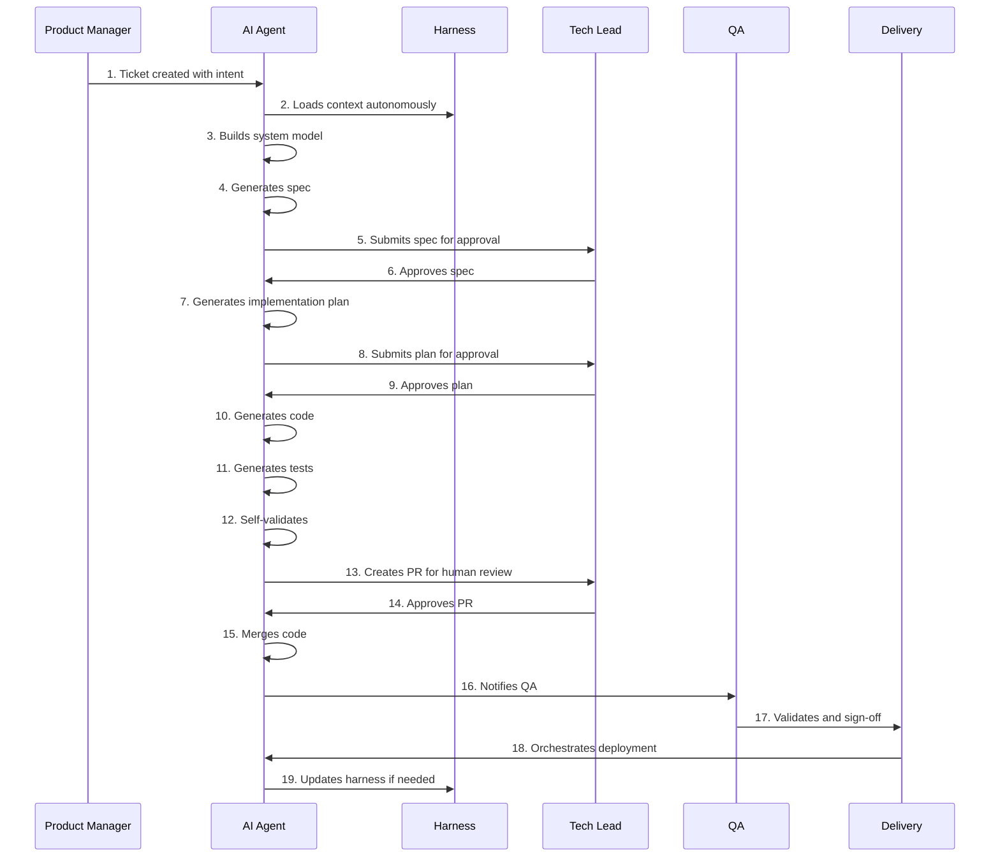

### 6.2 Inputs, Outputs, and Artifacts

| Phase | Agent Input | Agent Output | Human Output |
|-------|-------------|--------------|--------------|
| **Intake** | Jira ticket | Parsed intent | Clear requirements |
| **Discovery** | Harness + Repo | System model | – |
| **Planning** | System model | `spec.md`, `plan.md` | Spec/plan approval |
| **Execution** | Spec + Plan | Code, tests, docs | – |
| **Validation** | Code, tests | Test results, review | – |
| **Submission** | All outputs | PR, AI review | PR approval |
| **Release** | Merged code | Deployed system | Deployment approval |
| **Update** | Deployment metrics | Harness updates | – |

### 6.3 Agent Responsibilities

| Agent Action | Trigger | Output |
|--------------|---------|--------|
| **Discover** | Ticket received | Component inventory |
| **Load** | Component inventory | Harness context |
| **Model** | Harness context | System understanding |
| **Spec** | System understanding | `spec.md` |
| **Plan** | `spec.md` | `plan.md` |
| **Code** | `plan.md` | Implementation |
| **Test** | `spec.md` + Code | Tests |
| **Validate** | Code + Tests | Validation results |
| **Review** | All outputs | AI review |
| **PR** | All outputs | Pull request |
| **Merge** | PR approval | Merged code |
| **Update** | Learnings | Harness updates |

---

## 7. Workflow: Autonomous Bug Resolution

### 7.1 The Bug Flow

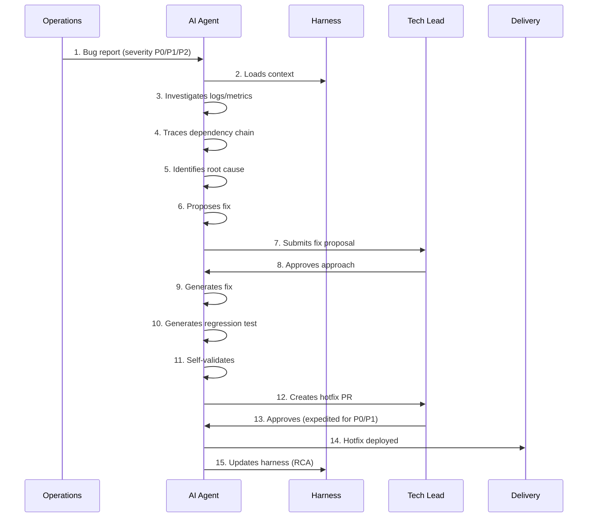

### 7.2 Severity-Based Agent Behavior

| Severity | Agent Action | Human Approval | Deployment |
|----------|--------------|----------------|------------|
| **P0** | Immediate investigation + fix | Tech Lead (urgent) | Expedited hotfix |
| **P1** | Immediate investigation + fix | Tech Lead (same day) | Expedited hotfix |
| **P2** | Investigation + fix | Tech Lead (standard) | Standard release |
| **P3** | Investigation + backlog | Team (next sprint) | Standard release |

### 7.3 Agent Investigation Steps

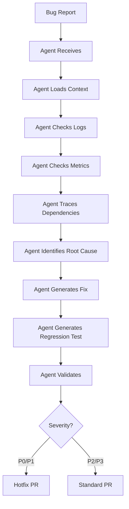

---

## 8. Workflow: Autonomous Refactoring

### 8.1 The Refactoring Flow

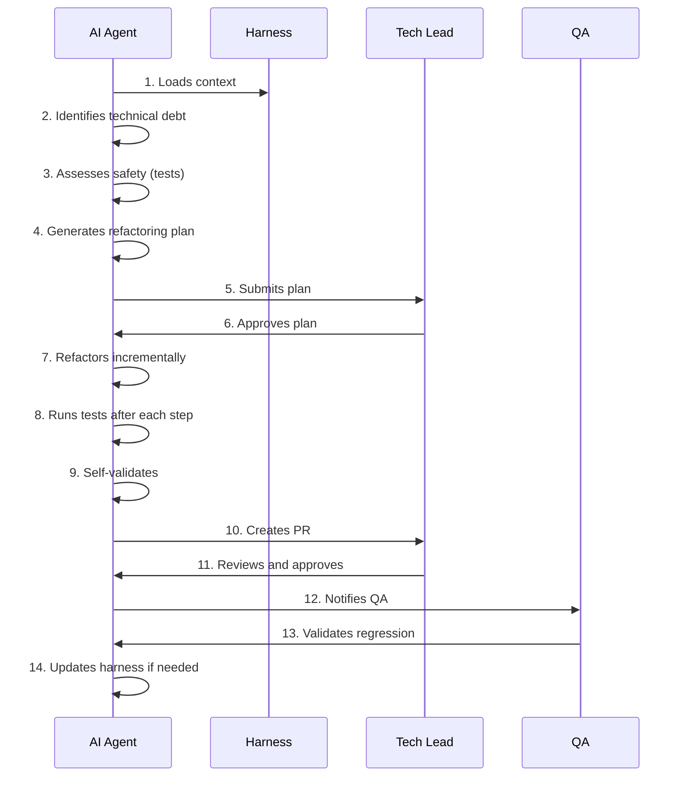

### 8.2 Safety Checks

| Check | Agent Action | Human Validation |
|-------|--------------|------------------|
| **Test coverage** | Verify ≥80% | Review coverage report |
| **Architecture boundaries** | Verify no cross-boundary refactor | Architecture review |
| **Dependencies** | Verify no breaking changes | Dependency review |
| **Performance** | Verify no degradation | Performance test review |

---

## 9. Workflow: Autonomous Repository Creation

### 9.1 The Repository Flow

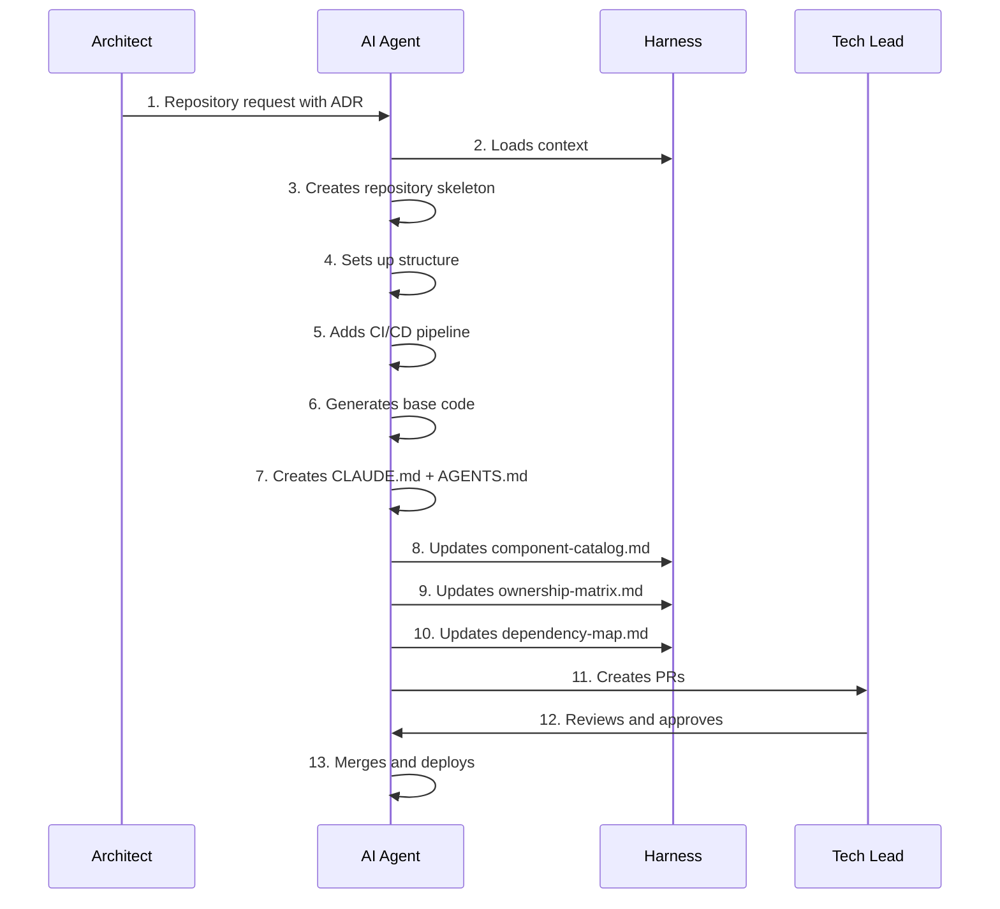

### 9.2 Agent-Created Repository Structure

```text
new-repo/
├── README.md
├── CLAUDE.md
├── AGENTS.md
├── .github/
│   ├── workflows/
│   │   └── ci.yml
│   └── copilot-instructions.md
├── src/
│   └── [service code]
├── tests/
│   └── [test code]
├── Dockerfile
├── docker-compose.yml
├── pyproject.toml
└── .env.example
```

### 9.3 Harness Updates (Automated)

| File | Update | Agent Action |
|------|--------|--------------|
| `component-catalog.md` | Add new repository | Autonomous |
| `ownership-matrix.md` | Add owners | Autonomous (with human confirmation) |
| `dependency-map.md` | Add dependencies | Autonomous |
| `component-matrix.md` | Add validation | Autonomous |

---

## 10. Workflow: Autonomous Architecture Evolution

### 10.1 The Architecture Flow

<p align="center">
  
</p>

*Figure 5: Autonomous Architecture Governance – how architecture changes are proposed and evolved.*

### 10.2 Agent Architecture Proposal

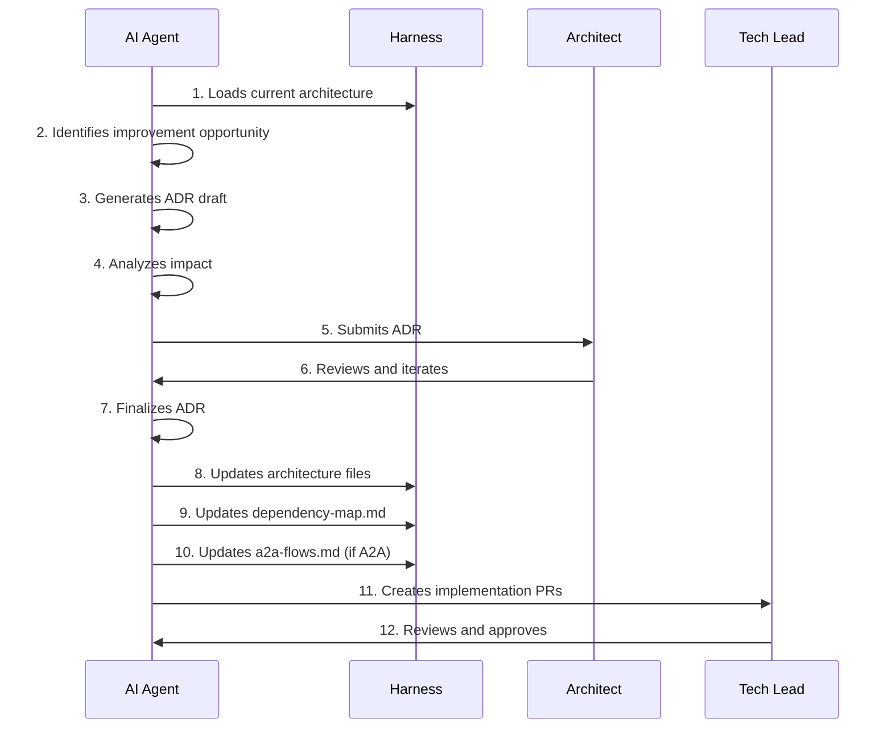

### 10.3 Agent-Generated ADR

```markdown
# ADR: [Title]

**Date:** [Auto-generated]
**Status:** [Draft | Proposed | Accepted | Deprecated]
**Author:** AI Agent [ID]

## Context
[Auto-generated from current architecture analysis]

## Decision
[Auto-generated based on identified improvement]

## Consequences
[Auto-generated impact analysis]

## Alternatives Considered
[Auto-generated from Harness knowledge]

## References
[Auto-generated from Harness references]
```

---

## 11. Agent Role Matrix

<p align="center">
  
</p>

*Figure 6: Agent Role Map – responsibilities across the autonomous system.*

### 11.1 Agent Responsibility Matrix

| Activity | Primary Agent | Investigation Agent | Generation Agent | Review Agent | Harness Agent | Human Supervisor |
|----------|---------------|---------------------|------------------|--------------|---------------|------------------|
| **Read ticket** | ✅ | – | – | – | – | – |
| **Explore repository** | ✅ | ✅ | – | – | – | – |
| **Load Harness context** | ✅ | ✅ | ✅ | ✅ | ✅ | – |
| **Build system model** | ✅ | ✅ | – | – | – | – |
| **Generate spec** | ✅ | – | – | – | – | ✅ (review) |
| **Generate plan** | ✅ | – | – | – | – | ✅ (review) |
| **Generate code** | – | – | ✅ | – | – | ✅ (review) |
| **Generate tests** | – | – | ✅ | – | – | – |
| **Self-validate** | ✅ | – | – | ✅ | – | – |
| **Run AI review** | – | – | – | ✅ | – | – |
| **Create PR** | ✅ | – | – | – | – | ✅ (approve) |
| **Update Harness** | – | – | – | – | ✅ | ✅ (review) |
| **Learn from deployment** | ✅ | – | – | – | ✅ | – |
| **Improve Harness** | – | – | – | – | ✅ | ✅ (review) |

### 11.2 Human Supervisor Matrix

| Activity | Tech Lead | Architect | PM | QA | Delivery | Engineer |
|----------|-----------|-----------|----|----|----------|----------|
| **Spec approval** | ✅ | – | ✅ | – | – | – |
| **Plan approval** | ✅ | – | – | – | – | – |
| **Code review** | ✅ | ✅ | – | – | – | – |
| **PR approval** | ✅ | ✅ | – | – | – | – |
| **Architecture review** | ✅ | ✅ | – | – | – | – |
| **Security review** | ✅ | ✅ | – | – | – | – |
| **QA validation** | – | – | – | ✅ | – | – |
| **Release approval** | – | – | – | – | ✅ | – |
| **Harness update review** | – | ✅ | – | – | – | – |
| **Agent oversight** | ✅ | ✅ | – | – | – | ✅ |

---

## 12. Supervisor Expectations

### 12.1 What Good Supervision Looks Like

| Good Supervision | Poor Supervision |
|------------------|------------------|
| ✅ Review agent-generated spec for business alignment | ❌ Approve spec without reading |
| ✅ Verify plan addresses architecture boundaries | ❌ Skip plan review |
| ✅ Validate code meets standards | ❌ Blindly approve AI code |
| ✅ Run security checks on agent output | ❌ Assume AI handled security |
| ✅ Provide clear feedback when rejecting | ❌ Vague "fix this" comments |
| ✅ Update Harness when you spot gaps | ❌ Leave Harness outdated |

### 12.2 Supervisor Checklist

**Before approving a spec:**

- [ ] Does it capture the business intent?
- [ ] Are acceptance criteria testable?
- [ ] Are technical constraints included?
- [ ] Are success metrics defined?

**Before approving a plan:**

- [ ] Are all affected components identified?
- [ ] Are dependencies traced?
- [ ] Is the risk assessment complete?
- [ ] Is the testing plan adequate?

**Before approving code:**

- [ ] Do tests pass?
- [ ] Is code coverage ≥80%?
- [ ] Are standards followed?
- [ ] Is security scanned?
- [ ] Is architecture respected?

**Before approving PR:**

- [ ] Is spec linked?
- [ ] Is AI evidence present?
- [ ] Is AI review complete?
- [ ] Are all approval gates green?

### 12.3 Escalation Triggers

| Trigger | Action |
|---------|--------|
| Agent fails validation 3+ times | Escalate to Tech Lead |
| Agent violates architecture | Escalate to Architect |
| Agent generates unsafe code | Escalate to Security |
| Agent fails to update Harness | Escalate to AI Champion |
| Multiple issues in same area | Escalate to Architecture Review |

---

## 13. Architect Expectations

### 13.1 Harness Authority

As the Harness Authority, the Architect:

- **Owns** the `architecture/` directory
- **Governs** all architecture decisions (ADRs)
- **Validates** agent-generated architecture changes
- **Maintains** the accuracy of the Harness
- **Evolves** the Harness as the system evolves

### 13.2 Architecture Governance

| Responsibility | Frequency | Agent Role |
|----------------|-----------|------------|
| Review all ADRs | As submitted | Agent drafts ADR |
| Ensure architecture files are AI-readable | Continuous | Agent verifies |
| Validate Harness matches reality | Monthly | Agent audits |
| Update architecture decisions | As needed | Agent implements |

### 13.3 Agent Supervision

- **Review** agent-generated ADRs
- **Validate** agent architecture proposals
- **Approve** Harness updates
- **Guide** agent evolution

---

## 14. Product Expectations

### 14.1 Intent Provider

Product Managers and Owners are the **Intent Providers** for the autonomous system. Clear intent enables accurate agent execution.

### 14.2 How to Write Agent-Readable Tickets

**Good Ticket:**

> **Feature:** Sustainability Filter
> **Intent:** Eco-conscious shoppers need to filter products by sustainability rating.
> **User:** Shopper searching for sustainable products.
> **Outcome:** Products with sustainability certifications appear when "sustainable" is mentioned.
> **AC:** Given a shopper asks for sustainable products, then only products with certifications are shown.
> **Success Metric:** 15% conversion on sustainable queries.

**Bad Ticket:**

> **Feature:** Add sustainability

### 14.3 Product Responsibilities

| Responsibility | Description | Agent Impact |
|----------------|-------------|--------------|
| **Intent clarity** | Write clear, testable tickets | Agent understands requirements |
| **Acceptance criteria** | Define Given/When/Then | Agent validates against criteria |
| **Success metrics** | Define measurable outcomes | Agent measures success |
| **Review specs** | Validate agent-generated specs | Agent receives feedback |

---

## 15. Delivery Oversight Expectations

### 15.1 Release Orchestration

Delivery Leads orchestrate autonomous releases:

| Responsibility | Description | Frequency |
|----------------|-------------|-----------|
| **Release planning** | Schedule autonomous releases | Weekly |
| **Agent performance** | Monitor agent execution metrics | Weekly |
| **Adoption tracking** | Track agent usage across teams | Weekly |
| **Risk management** | Identify and mitigate agent risks | Continuous |
| **Compliance** | Ensure agent outputs meet standards | Per PR |

### 15.2 Delivery Metrics

| Metric | Target | How Agent Contributes |
|--------|--------|----------------------|
| Agent adoption rate | 100% | Agent logs usage |
| Spec coverage | 100% | Agent generates specs |
| AI review coverage | 100% | Agent self-reviews |
| PR cycle time | < 4 hours | Agent accelerates execution |
| Harness accuracy | > 95% | Agent updates Harness |
| Release quality | No P0/P1 | Agent validates |

---

## 16. The Autonomous Development Lifecycle

<p align="center">
  
</p>

*Figure 7: The Complete Autonomous Development Lifecycle – end-to-end cycle with phase actors.*

### 16.1 Lifecycle Overview

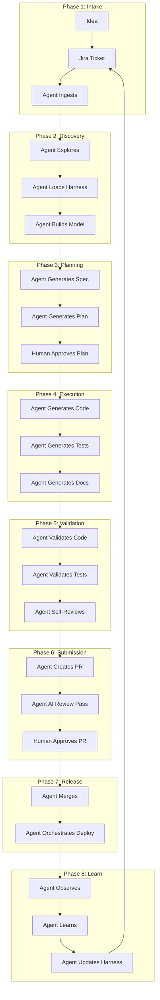

### 16.2 Phase Actor Responsibility

| Phase | Agent Action | Human Action | Harness Action |
|-------|--------------|--------------|----------------|
| **Intake** | Read ticket | Provide intent | – |
| **Discovery** | Explore, load, model | – | Provide context |
| **Planning** | Generate spec, plan | Review, approve | Provide templates |
| **Execution** | Generate code, tests | – | Enforce standards |
| **Validation** | Validate, review | – | Provide validation |
| **Submission** | Create PR, AI review | Approve PR | Check compliance |
| **Release** | Merge, deploy | Orchestrate | – |
| **Learn** | Observe, learn, update | – | Update intelligence |

---

## 17. System Artifacts

### 17.1 Artifact Requirements

| Artifact | Generated By | Used By | Storage |
|----------|--------------|---------|---------|
| **Jira Ticket** | Product | Agent | Jira |
| **Specification** | Agent | Human (review) | Repository `/specs/` |
| **Implementation Plan** | Agent | Human (review) | Repository `/plans/` |
| **Code** | Agent | Human (review) | Repository |
| **Tests** | Agent | Agent (validation) | Repository `/tests/` |
| **AI Review Output** | Agent | Human (review) | PR comment |
| **PR** | Agent | Human (review) | GitHub |
| **Harness Updates** | Agent | Human (review) | Harness repository |
| **ADR** | Agent | Human (review) | Harness repository |

### 17.2 Agent Artifact Flow

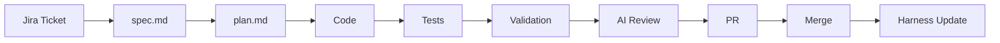

### 17.3 Artifact Validation (Agent Autonomous)

| Artifact | Agent Validation | Human Validation |
|----------|------------------|------------------|
| Spec | Complete? | Business alignment |
| Plan | Complete? | Approach correctness |
| Code | Standards, tests pass | Logic, architecture |
| Tests | Coverage ≥80% | Test completeness |
| PR | All checks pass | Final approval |
| Harness Update | Consistency | Accuracy |

---

## 18. Agent Governance Standards

### 18.1 Allowed Agent Actions

| Action | Description | Supervision |
|--------|-------------|-------------|
| **Read** | Read repository and Harness files | None (autonomous) |
| **Explore** | Explore codebase structure | None (autonomous) |
| **Discover** | Discover components and dependencies | None (autonomous) |
| **Generate** | Generate code, tests, docs | Human review |
| **Validate** | Validate code against standards | None (autonomous) |
| **Review** | Self-review | Human review |
| **Update** | Update Harness | Human review |
| **Learn** | Learn from system behaviour | None (autonomous) |

### 18.2 Prohibited Agent Actions

| Action | Why Prohibited |
|--------|----------------|
| **Production credentials** | Security risk |
| **PII without masking** | Privacy risk |
| **Destructive commands** | Operational risk |
| **Bypassing human review** | Quality risk |
| **Unauthorised Harness updates** | Knowledge accuracy risk |
| **Architecture changes without ADR** | System integrity risk |

### 18.3 Agent Execution Boundaries

| Boundary | Rule |
|----------|------|
| **A2A** | Agents communicate via Orchestrator |
| **MCP** | MCPs are stateless tool servers |
| **Architecture** | Respect component boundaries |
| **Security** | Never expose credentials |
| **Validation** | Never bypass quality gates |

---

## 19. Autonomous Execution Scenarios

### 19.1 Scenario: "I have a Jira ticket"

**Autonomous Execution Flow:**

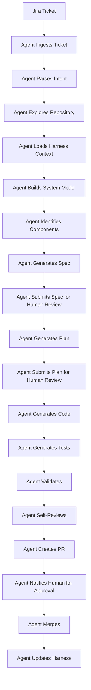

### 19.2 Scenario: "I need to build a new API"

**Agent Execution Flow:**

1. **Ingests ticket** – understands requirement
2. **Explores repository** – finds API patterns
3. **Loads Harness** – reads `api-landscape.md`
4. **Builds model** – understands existing APIs
5. **Generates spec** – uses `spec-template.md`
6. **Generates plan** – uses `create-plan.md`
7. **Generates code** – follows standards
8. **Generates tests** – covers endpoints
9. **Validates** – runs all checks
10. **Self-reviews** – checks contract validation
11. **Creates PR** – includes all artifacts
12. **Updates Harness** – updates `api-landscape.md`

### 19.3 Scenario: "I need to add a database table"

**Agent Execution Flow:**

1. **Ingests ticket** – understands requirement
2. **Loads Harness** – reads `coding-standards.md`
3. **Explores repository** – finds database patterns
4. **Generates migration** – uses ORM pattern
5. **Generates model** – follows standards
6. **Generates tests** – verifies operations
7. **Validates** – tests migration
8. **Creates PR** – includes migration
9. **Updates Harness** – updates `dependency-map.md`

### 19.4 Scenario: "I need to update an MCP"

**Agent Execution Flow:**

1. **Ingests ticket** – understands requirement
2. **Loads Harness** – reads `mcp-architecture.md`
3. **Explores repository** – finds MCP patterns
4. **Generates spec** – tool contract change
5. **Generates plan** – update approach
6. **Generates code** – updates MCP
7. **Generates tests** – validates contract
8. **Validates** – runs contract validation
9. **Creates PR** – includes update
10. **Updates Harness** – updates `mcp-architecture.md`

### 19.5 Scenario: "I need to fix production"

**Agent Execution Flow:**

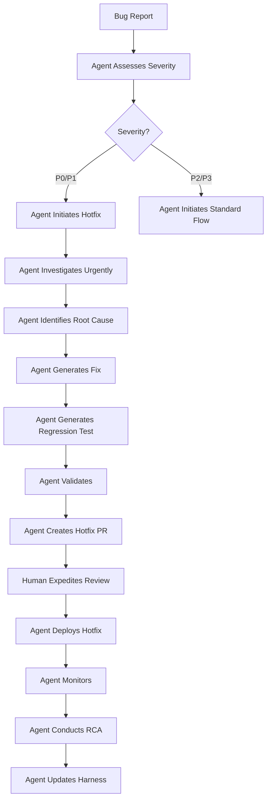

---

## 20. System Anti-Patterns

### 20.1 Anti-Pattern: Agent Without Context

| Bad | Good |
|-----|------|
| Agent executes without loading Harness | Agent loads Harness autonomously |
| Agent makes assumptions about architecture | Agent builds model from Harness |
| Agent violates standards | Agent follows Harness standards |
| **Consequence:** Wrong code, rework, violations | **Consequence:** Correct code, governance |

### 20.2 Anti-Pattern: Skipping Human Gate

| Bad | Good |
|-----|------|
| Agent merges without human review | Agent creates PR for human review |
| Agent bypasses approval | Agent waits for approval |
| Agent assumes correctness | Agent validates with human |
| **Consequence:** Quality issues, security gaps | **Consequence:** Quality, security |

### 20.3 Anti-Pattern: Harness Stagnation

| Bad | Good |
|-----|------|
| Agent never updates Harness | Agent updates Harness autonomously |
| Architecture drifts from Harness | Architecture matches Harness |
| Standards become outdated | Standards evolve with system |
| **Consequence:** Agent learns wrong patterns | **Consequence:** Agent learns correct patterns |

### 20.4 Anti-Pattern: Over-Autonomy

| Bad | Good |
|-----|------|
| Agent makes architecture decisions | Agent proposes architecture changes |
| Agent bypasses ADR process | Agent generates ADRs |
| Agent changes system without oversight | Agent submits changes for oversight |
| **Consequence:** System drift, technical debt | **Consequence:** Governed evolution |

### 20.5 Anti-Pattern: Human Oversight Failures

| Bad | Good |
|-----|------|
| Human approves without reviewing | Human reviews thoroughly |
| Human treats agent as infallible | Human validates agent outputs |
| Human ignores agent warnings | Human investigates agent warnings |
| **Consequence:** Mistakes reach production | **Consequence:** Quality maintained |

---

## 21. Adoption & Evolution Roadmap

### 21.1 Week 1: Foundation

| Day | Action | Agent Role | Human Role |
|-----|--------|------------|------------|
| 1 | Install agent tools | – | Engineers install Claude, Copilot |
| 2 | Clone Harness | Agent reads Harness | – |
| 3 | Read Playbook | Agent follows Playbook | All read Playbook |
| 4 | First autonomous demo | Agent executes small task | Supervise |
| 5 | Review and feedback | Agent logs learnings | Provide feedback |

### 21.2 Week 2: First Autonomous Feature

| Day | Action | Agent Role | Human Role |
|-----|--------|------------|------------|
| 1 | Agent receives ticket | Autonomously executes | – |
| 2 | Agent generates spec | Autonomously creates | Reviews spec |
| 3 | Agent generates plan | Autonomously creates | Reviews plan |
| 4 | Agent generates code | Autonomously creates | Reviews code |
| 5 | Agent submits PR | Autonomously creates | Approves PR |

### 21.3 Week 3: Scale

| Action | Agent Role | Human Role |
|--------|------------|------------|
| Multiple autonomous features | Executes in parallel | Supervises multiple agents |
| Harness learning | Learns from feedback | Updates Harness |
| Agent improvement | Self-optimises | Tunes agent behaviour |

### 21.4 Week 4: Maturity

| Action | Agent Role | Human Role |
|--------|------------|------------|
| Full autonomous delivery | End-to-end execution | Minimal oversight |
| Harness evolution | Updates Harness | Governs changes |
| Agent evolution | Learns and improves | Guides evolution |

### 21.5 Success Metrics

| Metric | Week 1 | Week 2 | Week 3 | Week 4 | Target |
|--------|--------|--------|--------|--------|--------|
| Agent adoption | 30% | 60% | 85% | 95% | 100% |
| Spec generation | 20% | 60% | 90% | 95% | 100% |
| Auto-review coverage | 10% | 50% | 85% | 95% | 100% |
| PR cycle time | 24h | 12h | 6h | 4h | <4h |
| Harness updates | 0 | 2 | 5 | 8+ | Continuous |

---

## 22. Visual Assets Reference

### 22.1 Asset Inventory

| # | Asset | Purpose |
|---|-------|---------|
| 1 | `Retail CC AI Operating Model.png` | Agent + Human + Harness interaction |
| 2 | `AI + Human Collaboration Model.png` | Agent-human partnership |
| 3 | `Harness Context Flow.png` | How agents load context |
| 4 | `Daily Engineer Workflow.png` | Autonomous execution pipeline |
| 5 | `Feature Delivery Lifecycle (Swimlane).png` | Swimlane of autonomous feature delivery |
| 6 | `Architecture Governance Flow.png` | Autonomous architecture evolution |
| 7 | `Role Responsibility Map.png` | Agent and human role matrix |
| 8 | `AI Development Lifecycle.png` | Complete autonomous lifecycle |

### 22.2 Asset Interpretation

All assets in this playbook depict **autonomous system behaviour**, not manual human workflow. The agents are the primary actors:

| Asset | Old Interpretation | New Interpretation |
|-------|-------------------|-------------------|
| **Operating Model** | Human leads, AI assists | Agent leads, Human supervises |
| **Daily Workflow** | Human follows steps | Agent executes pipeline |
| **Feature Delivery** | Human drives | Agent drives, Human gates |
| **Architecture Governance** | Human proposes | Agent proposes, Human approves |

---

## 📌 Appendices

### Appendix A: Agent Quick Reference

**For the Agent:**

```text
1. Read ticket → Parse intent → Explore repository → Load Harness → Build model
2. Generate spec → Generate plan → Submit for approval
3. Generate code → Generate tests → Validate → Self-review → Create PR
4. Wait for human approval → Merge → Deploy → Update Harness
```

**Required Harness Context (Autonomous):**

```text
Always load:
- README.md
- AGENTS.md
- architecture/system-overview.md
- architecture/component-catalog.md
- standards/engineering-rules.md
- standards/coding-standards.md
- standards/security-boundaries.md

Dynamic based on ticket type.
```

### Appendix B: Agent Checklist

**Before executing any ticket, agent must:**

- [ ] Load all mandatory Harness context
- [ ] Explore the affected repository
- [ ] Identify affected components
- [ ] Trace dependencies
- [ ] Assess risk

**Before creating PR, agent must:**

- [ ] Generate complete spec
- [ ] Generate complete plan
- [ ] Generate code
- [ ] Generate tests
- [ ] Validate all checks pass
- [ ] Self-review completed
- [ ] All required artifacts present

### Appendix C: Glossary

| Term | Definition |
|------|------------|
| **Autonomous Agent** | AI system that executes tasks without human guidance |
| **Harness** | `retail-cc-ai-harness` – the executable intelligence layer |
| **Playbook** | This document – the system specification |
| **Human Gate** | The point where a human reviews agent output |
| **Supervisor** | Human responsible for approving agent outputs |
| **Intent** | The business requirement provided to the agent |
| **ADR** | Architecture Decision Record – proposed by agent, approved by architect |
| **Pipeline** | The autonomous execution sequence from ticket to deployment |

---

## 📧 Feedback and Evolution

- **For agent behaviour issues:** Contact your AI Champion
- **For Harness gaps:** Agent will propose updates automatically
- **For system evolution:** Agent will propose ADRs

---

**This Playbook is the system specification for autonomous AI software engineering at Retail CC.**

---

*Retail CC – AI Engineering Excellence – June 2026*