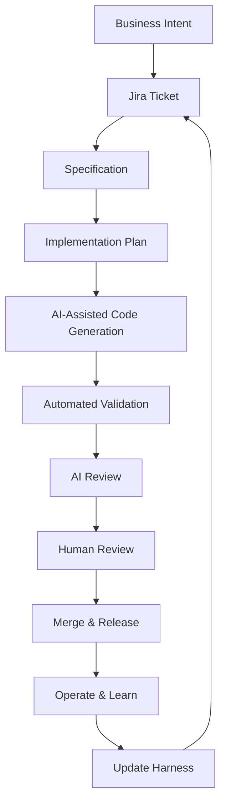
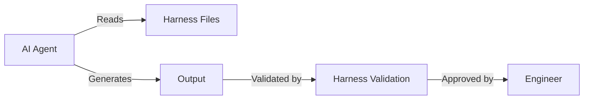
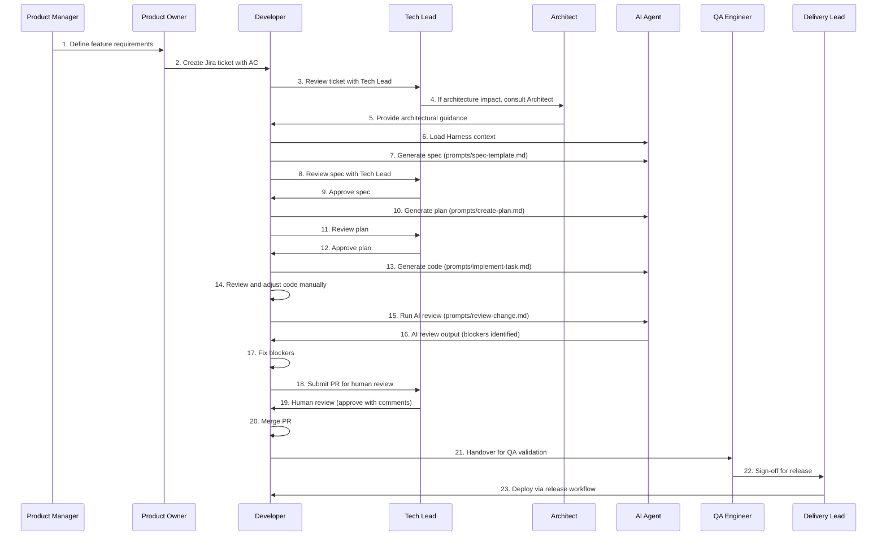
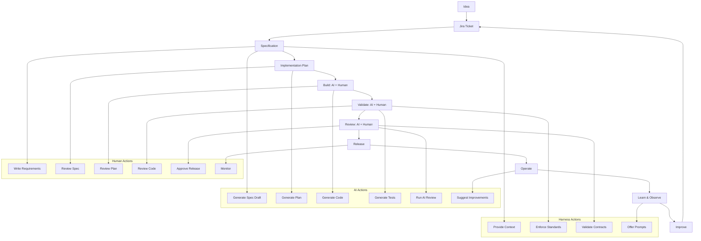

# Retail CC AI Engineering Playbook

**The Complete Operating System for AI-Native Engineering at Retail CC**

[](https://github.com/retail-cc/retail-cc-ai-playbook)
[](https://github.com/retail-cc/retail-cc-ai-playbook)
[](https://github.com/retail-cc/retail-cc-ai-playbook)

---

## 📖 Table of Contents

1. [Executive Summary](#1-executive-summary)
2. [The Retail CC AI Engineering Operating Model](#2-the-retail-cc-ai-engineering-operating-model)
3. [How AI Agents Access The Harness](#3-how-ai-agents-access-the-harness)
4. [Daily Engineering Workflow](#4-daily-engineering-workflow)
5. [Workflow: New Feature Development](#5-workflow-new-feature-development)
6. [Workflow: Bug Fix](#6-workflow-bug-fix)
7. [Workflow: Refactoring](#7-workflow-refactoring)
8. [Workflow: New Repository](#8-workflow-new-repository)
9. [Workflow: Architecture Change](#9-workflow-architecture-change)
10. [Role-Based Responsibilities](#10-role-based-responsibilities)
11. [Expectations For Engineers](#11-expectations-for-engineers)
12. [Expectations For Architects](#12-expectations-for-architects)
13. [Expectations For Product Teams](#13-expectations-for-product-teams)
14. [Expectations For Delivery Leads](#14-expectations-for-delivery-leads)
15. [AI Development Lifecycle](#15-ai-development-lifecycle)
16. [Required Artifacts](#16-required-artifacts)
17. [AI Usage Standards](#17-ai-usage-standards)
18. [Common Scenarios](#18-common-scenarios)
19. [Anti-Patterns](#19-anti-patterns)
20. [Adoption Roadmap](#20-adoption-roadmap)

---

## 1. Executive Summary

### Why This Playbook Exists

Retail CC has adopted **AI-native engineering** as its standard development model. This means every engineer, architect, product manager, and delivery lead must understand how AI tools, the **AI Harness**, and human judgment work together to produce high‑quality, secure, and architecturally‑sound software.

The **[`retail-cc-ai-harness`](https://github.com/retail-cc/retail-cc-ai-harness)** is the **knowledge base** – the single source of truth for architecture, standards, workflows, and prompts. It is machine‑readable and human‑readable.

This **Playbook** is the **operating manual** – it tells you **how** to use the Harness in your daily work.

Together, they form the complete AI‑native engineering system:

| Component | Purpose |
|-----------|---------|
| **Harness** | The "what" – architecture, standards, rules, prompts |
| **Playbook** | The "how" – processes, roles, expectations, examples |

### Why Every Team Member Must Understand This

| Role | Why They Need This |
|------|-------------------|
| **Engineer** | To write code correctly, efficiently, and safely with AI |
| **Senior Engineer** | To guide others, enforce standards, and deliver complex features |
| **Principal Engineer** | To set architectural direction and ensure AI respects boundaries |
| **Architect** | To maintain the integrity of the system and update the Harness |
| **Tech Lead** | To lead teams through AI‑native delivery and review |
| **Engineering Manager** | To track adoption, remove blockers, and measure success |
| **Product Manager** | To write requirements that AI can interpret and implement |
| **Product Owner** | To validate that AI delivers the right business outcomes |
| **Delivery Lead** | To plan and govern AI‑assisted sprints and releases |
| **QA Engineer** | To verify that AI‑generated code meets quality standards |
| **AI Champion** | To advocate, train, and continuously improve AI workflows |

---

> 🎯 **This playbook is mandatory reading for every Retail CC employee involved in software delivery.** Completion is tracked and expected within the first week of onboarding.

---

## 2. The Retail CC AI Engineering Operating Model

### The Core Principle

> **"AI writes code. Humans verify. The Harness governs."**

<p align="center">
  
</p>

*Figure 1: The Retail CC AI Engineering Operating Model – Human, AI Agent, and Harness collaboration.*

The diagram above shows the three primary actors:

- **Human** (Engineer, Architect, Product Manager, Tech Lead) – provides intent, reviews outputs, updates the Harness.
- **AI Agent** (Claude Code, Copilot, Cursor) – reads the Harness and generates code, tests, and reviews.
- **Harness** – provides architecture knowledge, standards, prompts, and validation.

```mermaid
flowchart LR
    subgraph Human["Human"]
        E[Engineer]
        A[Architect]
        PM[Product Manager]
        TL[Tech Lead]
    end

    subgraph AI["AI Agent"]
        C[Claude Code]
        G[GitHub Copilot]
        S[Cursor]
        F[Future Agents]
    end

    subgraph Harness["Retail CC AI Harness"]
        Arch[Architecture\nKnowledge]
        Std[Standards]
        Prompts[Workflow\nPrompts]
        Verif[Verification]
        Workflows[Processes]
    end

    subgraph Output["Work Products"]
        Spec[Specification]
        Plan[Implementation Plan]
        Code[Code]
        Tests[Tests]
        PR[PR + Review]
        Deploy[Deployed\nSystem]
    end

    Human -->|"Provide intent"| AI
    AI -->|"Read"| Harness
    AI -->|"Generate"| Output
    Output -->|"Review by"| Human
    Human -->|"Update"| Harness
    Human -->|"Approve/Reject"| Output
```



<p align="center">
  
</p>

*Figure 2: How Humans and AI Work Together – the partnership model.*

### The End‑to‑End Flow

Every piece of work follows this cycle:



### Key Roles in the Operating Model

| Role | Primary Responsibility | Works With |
|------|------------------------|------------|
| **Engineer** | Writes specs, reviews AI code, owns quality | AI, Harness, QA |
| **AI Agent** | Generates code, tests, and reviews according to Harness | Engineer, Harness |
| **Harness** | Provides context and governance | AI, Engineer, Architect |
| **Architect** | Maintains Harness accuracy and architecture boundaries | Harness, Principal Engineer |
| **Tech Lead** | Ensures process compliance and technical quality | Engineer, Architect |
| **QA** | Validates outputs and catches gaps | Engineer, AI |

---

## 3. How AI Agents Access The Harness

<p align="center">
  
</p>

*Figure 3: How AI Agents Load Harness Context – mandatory files for different task types.*

### 3.1 Claude Code (Primary Tool)

**Recommended for:** Complex multi‑file changes, architecture‑aware tasks, and full workflow execution.

**Mandatory Context Files:**

Claude must load these files **at the start of every session**:

```bash
claude --context README.md \
       --context architecture/system-overview.md \
       --context architecture/component-catalog.md \
       --context standards/engineering-rules.md
```

**Optional but Recommended Context (task‑dependent):**

| Task Type | Additional Files |
|-----------|------------------|
| Agent development | `architecture/agent-architecture.md`, `architecture/a2a-flows.md` |
| API changes | `architecture/api-landscape.md`, `verification/contract-validation.md` |
| MCP updates | `architecture/mcp-architecture.md` |
| Voice features | `architecture/voice-architecture.md` |
| Security review | `standards/security-boundaries.md` |
| Testing | `verification/test-strategy.md`, `standards/testing-standards.md` |

**Example Session:**

```bash
# Start Claude with essential context
claude --context README.md \
       --context architecture/system-overview.md \
       --context architecture/component-catalog.md \
       --context standards/engineering-rules.md

# Then prompt Claude using the harness prompts
# For a new feature:
cat prompts/spec-template.md | claude
# For implementation:
cat prompts/implement-task.md | claude
```

### 3.2 Cursor

**Recommended for:** Interactive coding, inline autocomplete, and exploring existing code.

**Setup:**

Add to your `.cursorrules` file in the root of each repository:

```markdown
# Retail CC AI Harness Context

When generating code, always reference the Retail CC AI Harness:
https://github.com/retail-cc/retail-cc-ai-harness

Key context files to consider:
- architecture/system-overview.md – platform structure
- architecture/component-catalog.md – component inventory
- standards/engineering-rules.md – core engineering rules
- standards/coding-standards.md – language‑specific guidelines
```

**Recommended Workflow:**

1. Open the relevant Harness file in a separate editor tab.
2. Ask Cursor to generate code, referencing the file explicitly:
   > "Using the standards in `standards/coding-standards.md`, generate a FastAPI endpoint for..."
3. Review and adapt the output.

### 3.3 GitHub Copilot

**Recommended for:** Inline suggestions, quick helpers, and boilerplate generation.

**Setup:**

Add a `.github/copilot-instructions.md` file to each repository (or globally):

```markdown
# Retail CC AI Harness Instructions

Follow the standards defined in:
- https://github.com/retail-cc/retail-cc-ai-harness/standards/coding-standards.md
- https://github.com/retail-cc/retail-cc-ai-harness/standards/engineering-rules.md

- Use TypeScript strict mode (no `any`)
- For Python, use type hints and Pydantic models
- All APIs must have OpenAPI annotations
- Prefer async/await for I/O operations
```

**Expected Use:**
- Writing unit tests
- Generating repetitive code (CRUD endpoints, DTOs)
- Quick refactoring suggestions
- Documentation generation

### 3.4 Future AI Agents

As new agents become available, they will integrate via the **Harness API** (not yet built). The integration pattern will be:



All agents must respect:
- **Architecture boundaries** (from `architecture/`)
- **Standards** (from `standards/`)
- **Workflow prompts** (from `prompts/`)

---

## 4. Daily Engineering Workflow

This is the **core loop** – a developer receives a Jira ticket and delivers it to production.

<p align="center">
  
</p>

*Figure 4: The Engineer's Daily Workflow – 11 steps from ticket to deployment.*

### Step 1: Receive and Understand the Ticket

- [ ] Read the ticket description and acceptance criteria.
- [ ] Identify the component(s) affected (use `architecture/component-catalog.md`).
- [ ] Identify the change type:
  - [ ] New feature
  - [ ] Bug fix
  - [ ] Refactoring
  - [ ] New repository
  - [ ] Architecture change

### Step 2: Load Harness Context

- [ ] Open the AI Harness repository (`retail-cc-ai-harness`).
- [ ] Load mandatory files into your AI tool:
  - `architecture/system-overview.md`
  - `architecture/component-catalog.md`
  - `standards/engineering-rules.md`
- [ ] Load additional context based on the affected component.

### Step 3: Create a Specification (`spec.md`)

- [ ] Copy the template: `cp prompts/spec-template.md specs/<jira-id>-<short-name>.md`
- [ ] Fill in all sections:
  - Business Intent
  - Acceptance Criteria
  - Technical Constraints
  - Verification Requirements
  - Success Metrics
  - Out of Scope
  - Dependencies
- [ ] **Do not skip any section.** Incomplete specs lead to poor AI output.
- [ ] Review the spec with the Tech Lead or Product Owner.

**Checklist for a Good Spec:**
- [ ] Business intent is clearly stated.
- [ ] Acceptance criteria are testable (Given/When/Then recommended).
- [ ] Technical constraints reference the Harness files.
- [ ] Out of scope is explicitly stated.
- [ ] Dependencies are identified.

### Step 4: Create an Implementation Plan (`plan.md`)

- [ ] Use the prompt: `cat prompts/create-plan.md | claude`
- [ ] Provide the spec as input.
- [ ] The AI will generate a plan covering:
  - Architecture impact assessment
  - Components affected
  - Orchestration considerations
  - Validation approach
  - Risk assessment
  - Estimated effort
- [ ] Review the plan and adjust estimates.

### Step 5: Generate Code

- [ ] Use the prompt: `cat prompts/implement-task.md | claude`
- [ ] Provide the spec and plan as input.
- [ ] The AI will generate:
  - Implementation code (with proper file paths)
  - Test code
  - Validation evidence
- [ ] **Do not** accept the code blindly. Review it for:
  - Standards compliance (use `standards/coding-standards.md`)
  - Architecture alignment (use `architecture/`)
  - Security (use `standards/security-boundaries.md`)

### Step 6: Local Validation

- [ ] Run unit tests: `pytest tests/unit`
- [ ] Run integration tests: `pytest tests/integration`
- [ ] Run linting: `ruff check .` or `npm run lint`
- [ ] Verify the code behaves as expected.
- [ ] Fix any issues manually or by regenerating with AI.

### Step 7: AI Review

- [ ] Use the prompt: `cat prompts/review-change.md | claude`
- [ ] Provide the full PR diff as input.
- [ ] The AI will produce a checklist with comments.
- [ ] Address all **blocker** issues before proceeding.
- [ ] **Do not skip** this step – it is mandatory for Track A compliance.

### Step 8: Human Review

- [ ] Create a PR with the AI-generated PR description (use `prompts/create-pull-request.md`).
- [ ] Include the AI review output as a comment or attachment.
- [ ] Request review from the appropriate Tech Lead (see `architecture/ownership-matrix.md`).
- [ ] Human reviewer checks:
  - Business correctness
  - Architecture fit
  - Production readiness
  - Operational safety
  - Edge‑case behavior

### Step 9: Merge

- [ ] After all checks pass (CI, AI review, human review), merge the PR.
- [ ] Ensure the Jira ticket is linked and updated.

### Step 10: Deploy

- [ ] Follow the release workflow (`workflows/release-workflow.md`).
- [ ] Staging deploy (Thursday) → Smoke tests → Regression.
- [ ] Production deploy (following week) with canary rollout.

---

## 5. Workflow: New Feature Development

### Scenario

A new feature is requested (e.g., "Visitor Memory Viewer" – the Jira ticket from Trial 1).

<p align="center">
  
</p>

*Figure 5: Feature Delivery Lifecycle – Swimlane showing roles across phases.*

### Swimlane Diagram



### Inputs, Outputs, and Artifacts

| Step | Inputs | Outputs | Owner |
|------|--------|---------|-------|
| Requirements | Business need | Jira ticket | PM/PO |
| Spec creation | Jira ticket, Harness context | `spec.md` | Developer |
| Plan creation | `spec.md` | `plan.md` | Developer |
| Implementation | `spec.md`, `plan.md` | Code, tests | Developer + AI |
| AI review | Code, tests | Review checklist | AI |
| Human review | PR, AI review | Approval/Request changes | Tech Lead |
| QA validation | Deployed code | Test evidence | QA |
| Release | Approved code | Production deployment | Delivery Lead |

### Responsibilities

| Role | Responsibility |
|------|----------------|
| **Product Manager** | Writes clear, concise feature requirements |
| **Product Owner** | Validates acceptance criteria and business value |
| **Developer** | Drives the entire workflow, owns quality and timeliness |
| **Tech Lead** | Approves spec, plan, and final code; ensures standards |
| **Architect** | Reviews architecture impact and updates Harness if needed |
| **AI Agent** | Generates drafts of specs, plans, code, tests, and reviews |
| **QA** | Validates functionality, edge cases, and regression |
| **Delivery Lead** | Tracks progress, ensures release readiness |

---

## 6. Workflow: Bug Fix

### Scenario

A production bug is reported (P1 or P2). The fix must be delivered quickly.

### Step-by-Step

**1. Triage (Delivery Lead / Tech Lead)**
- [ ] Assess severity (P0, P1, P2).
- [ ] Assign the bug to an engineer.
- [ ] If P0, initiate the **hotfix process** (`workflows/release-workflow.md`).

**2. Investigation (Engineer)**
- [ ] Load Harness context.
- [ ] Ask AI to investigate:
  - "Analyze this error log and identify likely causes."
  - "What components are involved?"
- [ ] Use `architecture/dependency-map.md` to trace impact.
- [ ] Review logs, metrics, and recent changes.

**3. Root Cause Identification**
- [ ] AI proposes potential root causes.
- [ ] Engineer validates manually.
- [ ] Confirm the exact root cause.

**4. Fix Proposal**
- [ ] AI generates a fix proposal (using `prompts/implement-task.md` with minimal changes).
- [ ] Engineer reviews the proposal.
- [ ] Ensure the fix is **targeted** – no scope creep.

**5. Implementation & Test**
- [ ] AI generates the fix and tests.
- [ ] Engineer runs tests and verifies locally.
- [ ] If needed, write a regression test to prevent recurrence.

**6. AI Review**
- [ ] Run `prompts/review-change.md` on the fix.
- [ ] Address any blockers.

**7. Human Review & Hotfix Approval**
- [ ] Tech Lead reviews the fix.
- [ ] If P0, get approval from Delivery Manager.
- [ ] Follow the hotfix deployment path.

**8. Deploy & Monitor**
- [ ] Deploy hotfix (no canary – full rollout).
- [ ] Monitor metrics closely for 1 hour.
- [ ] Conduct root cause analysis within 24 hours.

**Checklist for Bug Fix PR:**
- [ ] Jira ticket linked.
- [ ] Root cause explained in the PR description.
- [ ] Fix is minimal and targeted.
- [ ] Regression test added.
- [ ] AI review completed.
- [ ] Human review completed.
- [ ] Rollback plan documented.

---

## 7. Workflow: Refactoring

### Scenario

An engineer identifies technical debt (e.g., duplicate code, outdated patterns, or performance issues). They want to improve code without changing behavior.

### Safety First

Before any refactoring:
- [ ] Ensure **test coverage** is adequate (≥80%).
- [ ] Identify **architecture boundaries** – don't refactor across boundaries without approval.
- [ ] Create a **refactoring plan** – what, why, and how.

### AI-Assisted Refactoring

**1. Load Harness Context**
- [ ] Load `standards/coding-standards.md`, `architecture/dependency-map.md`.
- [ ] Load the relevant component files.

**2. Generate Refactoring Proposal**
- [ ] Use Claude: "Propose a refactoring plan for [component] to reduce duplication and improve maintainability. Follow Retail CC standards."
- [ ] AI outputs a plan with steps and estimated impact.

**3. Human Review of Proposal**
- [ ] Review the plan with Tech Lead.
- [ ] Ensure it doesn't violate architecture boundaries.

**4. Incremental Refactoring**
- [ ] Refactor one module at a time.
- [ ] Run tests after each change.
- [ ] Use AI to generate the refactored code.
- [ ] Manually verify behavior.

**5. Validation**
- [ ] Run full regression test suite.
- [ ] Run performance tests (if applicable).
- [ ] Review with Tech Lead.

**6. PR & Review**
- [ ] Follow standard PR process.
- [ ] Highlight that this is a refactoring – no functional change.
- [ ] Ensure reviewer focuses on maintainability.

**Anti‑Patterns to Avoid:**
- ❌ Refactoring without tests.
- ❌ Changing behavior during refactoring.
- ❌ Refactoring across architecture boundaries without consultation.
- ❌ Large, monolithic refactoring PRs.

---

## 8. Workflow: New Repository

### Scenario

A new service is needed (e.g., a new agent or a new integration adapter).

### Step-by-Step

**1. Architecture Review**
- [ ] Architect proposes the new repository in an ADR (`architecture/architecture-decisions.md`).
- [ ] Review the ADR with the Architecture Review Board.
- [ ] Approve the ADR before proceeding.

**2. Repository Creation**
- [ ] Create a new repository under the `retail-cc` GitHub organization.
- [ ] Follow naming conventions (`standards/naming-conventions.md`).
- [ ] Set up the base structure (template from `retailcc-base-a2a-agent` or `retailcc-base-mcp-server`).

**3. Harness Registration**
- [ ] Add the new repository to:
  - `architecture/component-catalog.md`
  - `architecture/dependency-map.md`
  - `architecture/ownership-matrix.md`
  - `architecture/component-matrix.md`
- [ ] Add a `CLAUDE.md` and `AGENTS.md` file to the new repo (see templates).

**4. Standards Onboarding**
- [ ] Ensure the repository includes:
  - CI/CD pipeline (copy from another service)
  - Linting and formatting
  - Test framework setup
  - Dockerfile and deployment manifests
- [ ] Reference the Harness `standards/` directory for coding rules.

**5. Initial Code Generation**
- [ ] Use AI to generate a "hello world" endpoint or agent skeleton.
- [ ] Follow `prompts/implement-task.md` with a minimal spec.

**6. Ownership Assignment**
- [ ] Assign Tech Lead and Architecture Reviewer in `ownership-matrix.md`.
- [ ] Define primary and secondary validation in `component-matrix.md`.

**7. Onboarding**
- [ ] Notify the team of the new repository.
- [ ] Update any relevant documentation (e.g., team Wiki).

**Checklist:**
- [ ] ADR approved.
- [ ] Repository created with correct naming.
- [ ] Harness files updated with the new component.
- [ ] CI/CD pipeline configured.
- [ ] Standards applied.
- [ ] Ownership defined.
- [ ] Initial code generated and merged.

---

## 9. Workflow: Architecture Change

### Scenario

An architect proposes a change to the system architecture (e.g., introducing a new agent communication pattern, changing the database, or splitting a service).

<p align="center">
  
</p>

*Figure 6: Architecture Governance Flow – how architecture changes are managed.*

### Step-by-Step

**1. ADR Creation**
- [ ] Create an Architecture Decision Record (ADR) using the template:
  - Decision
  - Rationale
  - Alternatives Considered
  - Consequences
- [ ] Add the ADR to `architecture/architecture-decisions.md`.

**2. Impact Analysis**
- [ ] Use the Harness to assess impact:
  - `architecture/dependency-map.md` – which components are affected?
  - `architecture/component-catalog.md` – which teams own them?
  - `architecture/a2a-flows.md` – if A2A changes, what agents are impacted?
- [ ] AI can assist: "Analyze the dependency map for component X and list all downstream dependencies."

**3. Harness Updates**
- [ ] Update any affected files:
  - `architecture/system-overview.md` – if the high-level view changes.
  - `architecture/component-catalog.md` – if components change.
  - `architecture/dependency-map.md` – if dependencies change.
  - `architecture/architecture-decisions.md` – record the decision.
- [ ] Ensure the AI Harness remains accurate.

**4. Agent Updates (if applicable)**
- [ ] If agent interfaces change, update `architecture/a2a-flows.md` and `architecture/agent-architecture.md`.
- [ ] Update `verification/contract-validation.md` if contracts change.

**5. Team Communication**
- [ ] Communicate the change to all affected teams.
- [ ] Provide a summary of the impact and timeline.
- [ ] Schedule a brown‑bag session if needed.

**6. Implementation**
- [ ] Create Jira tickets for each impacted component.
- [ ] Follow the standard feature development workflow for each ticket.

**7. Validation**
- [ ] Run full regression and contract validation.
- [ ] Ensure all tests pass after the architecture change.

---

## 10. Role-Based Responsibilities

### RACI Matrix: AI-Native Development

<p align="center">
  
</p>

*Figure 7: Role Responsibilities in AI‑Native Engineering – visual summary of RACI matrix.*

| Activity | Engineer | Sr. Eng. | Principal | Architect | Tech Lead | EM | PM | PO | QA | Delivery | AI Champion |
|----------|----------|----------|-----------|-----------|-----------|----|----|----|----|----------|-------------|
| **Define requirements** | C | C | C | C | C | C | R/A | R/A | C | C | C |
| **Review spec** | R | R/A | A | C | A | C | C | C | C | C | C |
| **Approve spec** | – | R | R | C | A | C | C | C | – | – | – |
| **Create plan** | R | R/A | C | C | C | C | – | – | – | – | – |
| **Generate code** | R | R | C | C | C | – | – | – | – | – | – |
| **AI review** | R | R | C | C | C | – | – | – | – | – | A |
| **Human review** | – | R/A | R | C | A | C | – | – | – | – | – |
| **Merge** | R | R | C | C | A | C | – | – | – | – | – |
| **Release** | C | C | C | C | R/A | C | C | C | C | R/A | C |
| **Update Harness** | C | C | R | R/A | C | C | – | – | – | – | A |
| **Train others** | C | R | R/A | R | R | C | – | – | – | – | A |
| **Track adoption** | – | C | C | C | C | R/A | C | C | – | R | A |

**Legend:**
- **R** = Responsible (does the work)
- **A** = Accountable (approves, owns outcome)
- **C** = Consulted (provides input)
- **–** = Not involved

---

### Role-Specific Responsibilities

#### Engineer
| Area | Responsibility |
|------|----------------|
| **Workflow** | Execute the full spec-first workflow for assigned tickets. |
| **AI Usage** | Use AI tools as recommended; always load Harness context. |
| **Quality** | Ensure code passes all automated and AI reviews. |
| **Documentation** | Update Harness files when you change architecture or standards. |
| **Learning** | Stay current with AI tools and Harness updates. |

#### Senior Engineer
- All Engineer responsibilities.
- **Mentorship**: Guide junior engineers on AI-native workflow.
- **Review**: Perform human reviews on complex changes.
- **Planning**: Help create implementation plans for large features.

#### Principal Engineer
- **Architecture**: Shape system architecture and ensure Harness reflects it.
- **Standards**: Define and enforce coding and design standards.
- **Adoption**: Drive AI-native practices across teams.
- **Decision Authority**: Approve major architecture changes.

#### Architect
- **Harness Ownership**: Maintain `architecture/` directory.
- **ADR**: Document and review all architecture decisions.
- **Boundaries**: Define and enforce component boundaries.
- **Training**: Lead architecture training sessions.

#### Tech Lead
- **Team Oversight**: Ensure team follows the AI-native workflow.
- **Quality Gates**: Approve PRs and ensure standards are met.
- **Escalation**: Resolve technical blockers and disputes.
- **Process**: Adapt the Playbook to team needs.

#### Engineering Manager
- **Adoption**: Track team adoption of AI tools (metrics, evidence).
- **Resource**: Ensure team has access to AI tools and Harness.
- **Performance**: Measure engineering productivity improvements.
- **Culture**: Foster a culture of responsible AI use.

#### Product Manager / Owner
- **Requirements**: Write Jira tickets that are AI‑readable (clear AC, context).
- **Spec Reviews**: Review specs to ensure they match business intent.
- **Acceptance**: Validate that the delivered feature meets AC.

#### QA Engineer
- **Validation**: Run test suites and verify AI‑generated code.
- **Automation**: Contribute to test automation and smoke tests.
- **Quality Metrics**: Track defect rates and test coverage.

#### Delivery Lead
- **Planning**: Schedule releases and track milestones.
- **Risk Management**: Identify and mitigate risks in AI‑assisted delivery.
- **Compliance**: Ensure all PRs have required evidence.
- **Reporting**: Provide status to leadership.

#### AI Champion
- **Advocacy**: Promote AI‑native practices across the organisation.
- **Training**: Create and deliver training materials.
- **Feedback**: Collect and action feedback on AI tools and Harness.
- **Improvement**: Continuously refine prompts and workflows.

---

## 11. Expectations For Engineers

### What Good Looks Like

| Good Practice | Bad Practice |
|---------------|--------------|
| ✅ Always load the Harness before prompting AI. | ❌ Prompt without any context. |
| ✅ Create a spec before writing a single line of code. | ❌ Jump straight into code. |
| ✅ Review all AI‑generated code and tests. | ❌ Accept code without reading it. |
| ✅ Run AI review before human review. | ❌ Skip AI review because you trust the code. |
| ✅ Include AI evidence in every PR. | ❌ Submit PRs without AI disclosure. |
| ✅ Update Harness files when you change architecture. | ❌ Leave documentation outdated. |
| ✅ Ask AI to explain its reasoning when unclear. | ❌ Treat AI output as final without question. |
| ✅ Use the exact prompts from the Harness. | ❌ Write ad‑hoc prompts without structure. |

### Checklist for Every Ticket

Before starting any ticket, ask yourself:

- [ ] Do I have the Harness repository open?
- [ ] Have I loaded `system-overview.md`, `component-catalog.md`, and `engineering-rules.md`?
- [ ] Do I know which component(s) are affected?
- [ ] Have I read the relevant architecture files for that component?

During work:

- [ ] Is my spec complete and reviewed?
- [ ] Did I generate a plan?
- [ ] Did I use the AI prompts to generate code and tests?
- [ ] Did I review the code and tests?
- [ ] Did I run AI review?
- [ ] Did I fix all blockers?

Before submitting a PR:

- [ ] Does the PR include all required artifacts (spec, plan, tests, AI review)?
- [ ] Is the AI disclosure complete?
- [ ] Have I assigned the correct human reviewer?

---

## 12. Expectations For Architects

### Architecture Governance

| Responsibility | Frequency |
|----------------|-----------|
| Review all ADRs | As submitted |
| Update `architecture/` files | After every architecture change |
| Ensure architecture files are AI‑readable | Continuously |
| Conduct architecture review for major changes | Per PR |
| Validate that Harness matches reality | Monthly |

### Harness Ownership

- You are the **primary owner** of the `architecture/` and `standards/` directories.
- Ensure every architecture decision is documented in ADRs.
- Review all changes to architecture files in PRs.
- Train other architects on Harness maintenance.

### Documentation Ownership

- Ensure all architecture files are up‑to‑date.
- Add new files when new components are added.
- Remove or archive files when components are deprecated.
- Ensure cross‑links between files are maintained.

### Boundary Ownership

- Define and enforce component boundaries.
- Update `architecture/dependency-map.md` when dependencies change.
- Review any change that crosses architecture boundaries.

---

## 13. Expectations For Product Teams

### How Product Works with AI-Native Engineering

| Activity | Product Responsibility |
|----------|------------------------|
| **Writing Requirements** | Write clear, testable acceptance criteria. Use Given/When/Then format. |
| **Spec Review** | Review specs to ensure they capture business intent and outcomes. |
| **Prioritisation** | Ensure the backlog is prioritised so engineers can plan effectively. |
| **Success Metrics** | Define measurable success metrics for each feature. |
| **Feedback** | Provide timely feedback on delivered features. |

### How Requirements Should Be Written

**Good Example:**

> **AC:** Given a visitor has viewed 3 products, when they start a new conversation, then the assistant should ask about their recently viewed items.

**Bad Example:**

> **AC:** The system should remember products.

### How Specs Should Be Reviewed

- [ ] Does the spec match the business intent?
- [ ] Are the acceptance criteria testable?
- [ ] Are success metrics defined?
- [ ] Is out of scope clearly stated?
- [ ] Are dependencies identified?

---

## 14. Expectations For Delivery Leads

### Planning

- Ensure all features have specs before sprint planning.
- Allocate time for spec creation and AI‑assisted development.
- Track AI tool adoption as part of delivery metrics.

### Tracking

| Metric | Target | How to Measure |
|--------|--------|----------------|
| PRs with AI evidence | 100% | Check PR checklist |
| Spec‑first coverage | 100% | Check for `spec.md` per ticket |
| AI review completion | 100% | Check PR comments |
| Human review time | ≤24 hours | Measure time from PR to merge |
| Release quality | No P0/P1 in production | Incident tracking |

### Compliance

- Ensure every PR has:
  - Jira link
  - AI disclosure
  - AI review output
  - Human review approval
  - Tests evidence

### Adoption

- Monitor AI tool usage (Copilot, Claude, Cursor).
- Share success stories and best practices.
- Address concerns and blockers promptly.

### Risk Management

- Identify risks in AI‑assisted delivery (e.g., over‑reliance on AI, hallucinated code).
- Mitigate with human review, testing, and validation.
- Maintain a rollback plan for every release.

---

## 15. AI Development Lifecycle

<p align="center">
  
</p>

*Figure 8: The Complete AI Development Lifecycle – end-to-end cycle with phases and actor responsibilities.*

### The Complete Lifecycle



### Phases and Responsibilities

| Phase | Human Role | AI Role | Harness Role |
|-------|------------|---------|--------------|
| **Idea** | Product defines business need | – | – |
| **Ticket** | PM/PO writes ticket | – | – |
| **Spec** | Engineer writes spec | Generates draft | Provides template |
| **Plan** | Engineer reviews plan | Generates plan | Provides prompts |
| **Build** | Engineer reviews code | Generates code & tests | Enforces standards |
| **Validate** | QA runs tests | Runs automated checks | Validates contracts |
| **Review** | Tech Lead approves | Runs AI review | Checks compliance |
| **Release** | Delivery Lead deploys | – | – |
| **Operate** | SRE monitors | – | – |
| **Learn** | Engineer / Architect | Suggests improvements | Updates context |
| **Improve** | All | – | Harness updated |

---

## 16. Required Artifacts

For every work item, the following artifacts **must** be produced and stored:

| Artifact | Purpose | Owner | Storage |
|----------|---------|-------|---------|
| **Jira Ticket** | Requirement and tracking | PM/PO | Jira |
| **Specification (`spec.md`)** | Source of truth for implementation | Engineer | Repository `/specs/` |
| **Implementation Plan (`plan.md`)** | Approach and risk assessment | Engineer | Repository `/plans/` |
| **Code** | Implementation | Engineer + AI | Repository |
| **Tests** | Validation | Engineer + AI | Repository `/tests/` |
| **AI Review Output** | Evidence of AI review | AI | PR comment or `reviews/` |
| **PR Description** | Summary and checklist | Engineer | GitHub PR |
| **Human Review Approval** | Business and architecture sign‑off | Tech Lead | PR review |
| **QA Evidence** | Validation evidence | QA | Jira or test system |
| **Release Notes** | Summary of changes | Delivery Lead | Jira / Confluence |
| **Harness Updates** | If architecture changed | Engineer / Architect | Harness repository |

### Example Checklist for a Feature PR

```markdown
## Required Artifacts Checklist

- [ ] Jira ticket linked: [BRAIN-1234]
- [ ] Specification: `specs/BRAIN-1234-feature.md`
- [ ] Implementation plan: `plans/BRAIN-1234-plan.md`
- [ ] Code changes reviewed and tested
- [ ] Unit tests added/updated
- [ ] Integration tests added/updated
- [ ] AI review output attached: `reviews/BRAIN-1234-ai-review.md`
- [ ] Human review completed by: @tech-lead
- [ ] QA validation signed off: @qa-lead
- [ ] Harness updates (if applicable): PR to harness repository
```

---

## 17. AI Usage Standards

### Allowed Uses

- ✅ Generating boilerplate code and tests.
- ✅ Refactoring existing code for clarity.
- ✅ Producing initial drafts of specs and plans.
- ✅ Creating documentation.
- ✅ Reviewing code for standards, security, and architecture.
- ✅ Investigating bugs and proposing fixes.
- ✅ Suggesting performance optimisations.

### Expected Uses

- ✅ Use AI as a **pair programmer** – not a replacement.
- ✅ Use AI to **explore alternatives** and reason about trade‑offs.
- ✅ Use AI to **verify** that code meets standards.
- ✅ Use AI to **generate tests** for edge cases.

### Discouraged Uses

- ❌ Asking AI to generate code without understanding the requirements.
- ❌ Using AI to bypass security reviews.
- ❌ Using AI to generate code for a component you don't understand.
- ❌ Using AI without providing sufficient context (Harness files).
- ❌ Treating AI output as final without human verification.

### Prohibited Uses

- 🚫 Using AI to access or generate production credentials.
- 🚫 Using AI to inject malicious or unauthorized code.
- 🚫 Using AI to bypass human review or compliance.
- 🚫 Using AI for tasks that require deep business or ethical judgment.
- 🚫 Using AI outside the approved list (Claude, Copilot, Cursor).

### Examples

| Scenario | Correct Use | Incorrect Use |
|----------|-------------|---------------|
| **New endpoint** | Load Harness, write spec, use AI to generate endpoint and tests, review. | Prompt "write a FastAPI endpoint" without context, blindly merge. |
| **Bug fix** | Ask AI to investigate and propose fix, review and test. | Ask AI to fix, merge without testing. |
| **Refactoring** | Ask AI for a plan, refactor incrementally, run tests. | Ask AI to refactor a whole file in one go. |

---

## 18. Common Scenarios

### Scenario 1: I have a Jira ticket

1. Open the Harness repository.
2. Load mandatory context into your AI tool.
3. Create a spec using `prompts/spec-template.md`.
4. Review the spec with your Tech Lead.
5. Generate a plan using `prompts/create-plan.md`.
6. Implement using `prompts/implement-task.md`.
7. Run AI review using `prompts/review-change.md`.
8. Fix blockers.
9. Submit PR with `prompts/create-pull-request.md`.

### Scenario 2: I need to build a new API

1. Review `architecture/api-landscape.md` to understand existing APIs.
2. Update or add a new endpoint specification.
3. Follow the spec-first workflow.
4. Ensure the new API includes OpenAPI documentation.
5. Add contract validation (`verification/contract-validation.md`).
6. Update `api-landscape.md` with the new endpoint.

### Scenario 3: I need to add a database table

1. Review `standards/coding-standards.md` for ORM rules.
2. Use AI to generate the migration script.
3. Ensure the migration is reversible (up/down).
4. Follow the spec-first workflow.
5. Include the migration in the PR.
6. Update `architecture/dependency-map.md` if the new table affects dependencies.

### Scenario 4: I need to update an MCP

1. Review `architecture/mcp-architecture.md`.
2. Update the MCP tool schema in the code.
3. Update `mcp-architecture.md` with the new tool parameters.
4. Ensure backward compatibility or version the tool.
5. Follow the standard spec-first workflow.
6. Update `verification/contract-validation.md` if the contract changes.

### Scenario 5: I need to create a new Agent

1. Review `architecture/agent-architecture.md` and `architecture/a2a-flows.md`.
2. Use the base agent template (`retailcc-base-a2a-agent`).
3. Follow the spec-first workflow for the new agent.
4. Register the agent in the A2A Registry.
5. Update `component-catalog.md` and `ownership-matrix.md`.
6. Add the agent to `a2a-flows.md` and `agent-architecture.md`.

### Scenario 6: I need to modify orchestration

1. Review `architecture/orchestrator-architecture.md`.
2. Update the Orchestrator code using the spec-first workflow.
3. Run orchestration validation (`verification/orchestration-validation.md`).
4. Ensure the A2A contracts remain compatible.
5. Update `dependency-map.md` and `orchestrator-architecture.md`.

### Scenario 7: I need to update contracts

1. Review `verification/contract-validation.md`.
2. Make the contract change in the code.
3. Run contract validation to ensure no breaking changes.
4. If breaking, create a new version (major version).
5. Update `contract-validation.md` and `api-landscape.md`.

### Scenario 8: I need to fix production

1. Follow the **hotfix process** (`workflows/release-workflow.md`).
2. Use AI to investigate and propose a fix.
3. Run AI review and human review.
4. Deploy using the hotfix path.
5. Conduct root cause analysis.

---

## 19. Anti-Patterns

### Anti‑Pattern 1: Prompting Without Context

**Consequence:** AI generates code that violates architecture, standards, or security.

**Solution:** Always load the relevant Harness files before prompting.

### Anti‑Pattern 2: Skipping Specs

**Consequence:** No traceability, unclear requirements, and poor AI output.

**Solution:** Create a spec for every feature, no matter how small.

### Anti‑Pattern 3: Skipping AI Review

**Consequence:** Misses standards violations, security gaps, and architecture issues.

**Solution:** Run AI review as the first pass on every PR.

### Anti‑Pattern 4: Blindly Accepting AI Code

**Consequence:** Bugs, security vulnerabilities, and poor design.

**Solution:** Review every line of AI‑generated code.

### Anti‑Pattern 5: Ignoring Ownership

**Consequence:** Unclear escalation paths and knowledge silos.

**Solution:** Always refer to `architecture/ownership-matrix.md`.

### Anti‑Pattern 6: Ignoring Contracts

**Consequence:** Integration failures and broken compatibility.

**Solution:** Always run contract validation on contract changes.

### Anti‑Pattern 7: Ignoring Architecture

**Consequence:** Entropy, technical debt, and system fragility.

**Solution:** Respect component boundaries and update the Harness when architecture changes.

### Anti‑Pattern 8: Duplicating Harness Documentation

**Consequence:** Inconsistency and outdated information.

**Solution:** Point to the Harness; do not duplicate its content.

### Anti‑Pattern 9: Not Updating the Harness

**Consequence:** AI becomes outdated and generates wrong code.

**Solution:** Update the Harness whenever the system or standards change.

### Anti‑Pattern 10: Using AI for Sensitive Decisions

**Consequence:** Compliance and ethical risks.

**Solution:** Use human judgment for business, security, and ethical decisions.

---

## 20. Adoption Roadmap

### Week 1: Foundation

- [ ] All engineers install and configure approved AI tools (Claude, Copilot, Cursor).
- [ ] All engineers read the Harness `README.md` and this Playbook.
- [ ] Tech Leads create a team channel for AI‑related questions.
- [ ] Identify the AI Champion for your team.

### Week 2: First Workflows

- [ ] Pick a small, low‑risk ticket to practice the spec‑first workflow.
- [ ] Follow the daily engineering workflow steps.
- [ ] The AI Champion provides office hours for questions.
- [ ] Collect feedback on the experience.

### Week 3: Standardisation

- [ ] All new features must follow the spec‑first workflow.
- [ ] AI review becomes mandatory for all PRs.
- [ ] PR checklist updated to include AI evidence.
- [ ] Team retro discusses AI usage and improvements.

### Week 4: Maturity

- [ ] All team members are comfortable with the workflow.
- [ ] AI usage metrics show consistent adoption.
- [ ] Harness contributions (updates) are made as needed.
- [ ] Team shares learnings with other teams.

### Success Metrics

| Metric | Week 1 | Week 2 | Week 3 | Week 4 |
|--------|--------|--------|--------|--------|
| AI tool installation | 100% | – | – | – |
| Spec‑first coverage | 50% | 75% | 90% | 95% |
| AI review coverage | 30% | 70% | 90% | 95% |
| PRs with AI evidence | 20% | 60% | 85% | 95% |
| Harness updates | 0 | 2 | 5 | 8+ |
| Engineer confidence (survey) | 3/5 | 4/5 | 4.5/5 | 5/5 |

---

## 📌 Appendices

### Appendix A: Quick Reference Cards

Print these and keep them at your desk.

**Quick Start for a New Ticket:**
1. Load Harness: `claude --context README.md --context architecture/system-overview.md --context architecture/component-catalog.md --context standards/engineering-rules.md`
2. Create spec: `cp prompts/spec-template.md specs/<ticket-id>.md`
3. Create plan: `cat prompts/create-plan.md | claude`
4. Implement: `cat prompts/implement-task.md | claude`
5. AI review: `cat prompts/review-change.md | claude`
6. Create PR: `cat prompts/create-pull-request.md | claude`

**PR Checklist:**
- [ ] Spec linked
- [ ] AI evidence disclosed
- [ ] Tests present
- [ ] AI review completed
- [ ] Human review completed
- [ ] Harness updated (if applicable)

**Required Files to Load by Task:**
| Task | Files |
|------|-------|
| All | `architecture/system-overview.md`, `architecture/component-catalog.md`, `standards/engineering-rules.md` |
| Agent work | Plus `architecture/agent-architecture.md`, `architecture/a2a-flows.md` |
| API work | Plus `architecture/api-landscape.md`, `verification/contract-validation.md` |
| MCP work | Plus `architecture/mcp-architecture.md` |
| Security review | Plus `standards/security-boundaries.md` |
| Testing | Plus `verification/test-strategy.md`, `standards/testing-standards.md` |

---

### Appendix B: Glossary

| Term | Definition |
|------|------------|
| **Harness** | The `retail-cc-ai-harness` repository – the AI-readable knowledge base. |
| **Playbook** | This document – the operational manual. |
| **Spec** | A specification document created before implementation. |
| **AI Evidence** | The disclosure in a PR showing which AI tools were used. |
| **AI Review** | The first-pass review performed by an AI agent. |
| **Human Review** | The second-pass review by a Tech Lead or Architect. |
| **A2A** | Agent-to-Agent protocol for communication between agents. |
| **MCP** | Model Context Protocol – a tool interface standard. |
| **SHIELD** | The security framework: Separation, Human, Input, Encryption, Least Agency, Deterministic. |
| **ADR** | Architecture Decision Record. |

---

### Appendix C: Change Log

| Version | Date | Author | Changes |
|---------|------|--------|---------|
| 1.0 | 2026-06-19 | AI Solutions Architect | Initial release |

---

## 📧 Feedback and Questions

- **For questions on the Playbook:** Contact your AI Champion or the Engineering Excellence team.
- **For Harness updates:** Submit a PR to the `retail-cc-ai-harness` repository.
- **For AI tool access:** Check with your Engineering Manager.

---

**This Playbook is a living document.** It will be updated as the Harness evolves and as teams provide feedback.

---

*End of Document*

---

*Retail CC – Engineering Excellence – June 2026*